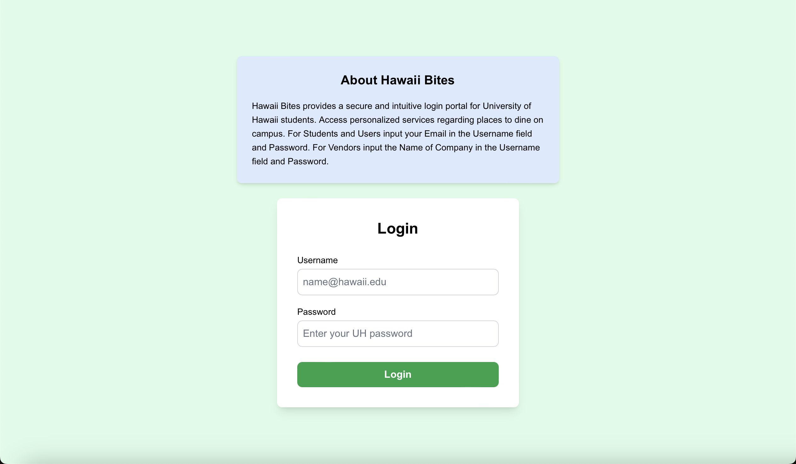

## Hawaii Bites: Enhancing Campus Dining

### Overview
Hawaii Bites is a secure and intuitive login portal designed for University of Hawaii students and vendors. The application provides personalized services, helping students discover and access dining options on campus while offering vendors a platform to manage their listings. This project emphasizes user-friendly design and robust functionality to create a seamless experience for both students and vendors.

You can explore the live application here: [Hawaii Bites Homepage](https://hawaii-bites.github.io)

### My Contributions
As a member of the Hawaii Bites development team, I was actively involved in designing and implementing the following:

- **Frontend Development:** Collaborated on the development of the login and registration pages, ensuring a responsive and visually appealing user interface using React and Bootstrap.
- **Backend Integration:** Assisted in setting up the API endpoints to securely authenticate users and retrieve personalized dining information.
- **Testing and Debugging:** Conducted extensive testing to ensure the platform’s functionality met user requirements and resolved bugs to enhance usability and performance.

### Lessons Learned
Through this project, I gained valuable experience in:
- Developing a full-stack application using modern frameworks like Next.js and Bootstrap.
- Strengthening my skills in creating intuitive user interfaces and integrating them with backend services.
- Collaborating effectively within a team, using GitHub for version control and project management.

### Screenshots
Here’s a preview of the Hawaii Bites application:

### GitHub Repository
To view the source code and learn more about the Hawaii Bites project, visit the [Hawaii Bites GitHub Organization Page](https://hawaii-bites.github.io).
